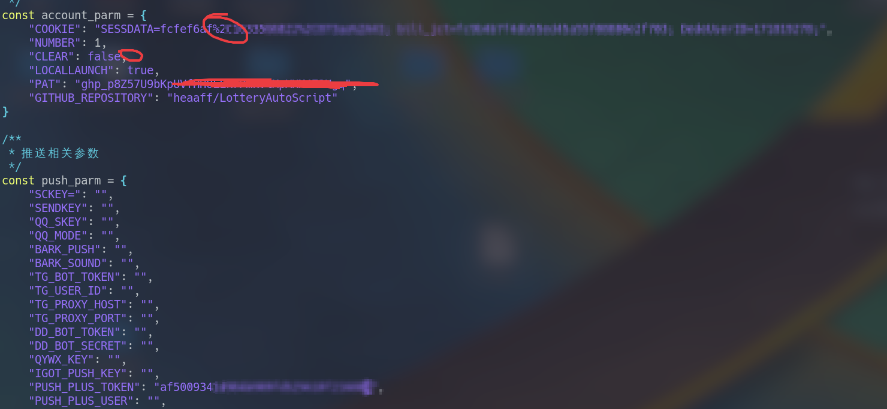
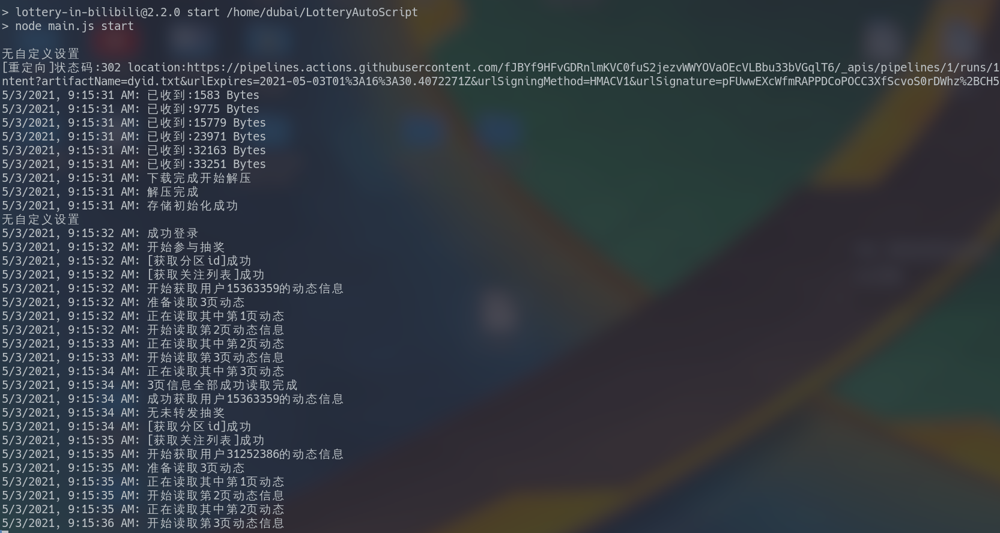

1.通过ssh连接服务器

1.1安装node

根据自己服务器的版本使用对应的命令安装

百度一下即可     eg.Ubuntu如何安装nodejs

2.下载脚本到本地

git clone https://github.com/shanmite/LotteryAutoScript.git

注意 github访问下载速度可能很慢  如过卡主了可以通过github镜像网站下载

命令： git clone https://github.com.cnpmjs.org/shanmite/LotteryAutoScript.git

3.cd命令进入目录,将其中的`env.example.js`文件重命名为`env.js`

mv env.example.js  env.js

4.编辑env.js

vim env.js       按i进入编辑模式    改完了用esc+wq保存退出

说明: "CLEAR"设置为TRUE  才可以自动开启自动清理动态功能

"PAT"和"GITHUB_REPOSITORY"不填应该也行

5.设置定时工作

crontab -e   写入

SHELL 和 PATH照着填

MAILTO不填也行

注意HOME  后面跟脚本所在的目录       这样才能到那个目录下去执行命令

关于脚本的定时时间自定义 可以参照此文 https://zhuanlan.zhihu.com/p/58719487

6.手动运行一波

cd 进入文件目录

npm i

npm run start 

看看有没有效果

1.如果需要linux运行多用户 

提供以下思路：

可以拷贝一下文件到别的目录

在/etc/cron.d目录中新建脚本文件 xxx.sh

文件的内容可以和crontab -e打开的内容一样    换个目录就行

2.如果本地的脚本需要更新

建议先把 env.js 和 my_config.json做个备份  然后执行脚本命令

cd /home/dubai&&/bin/rm -rf LotteryAutoScript/&& git clone https://github.com.cnpmjs.org/shanmite/LotteryAutoScript.git &&/bin/rm -rf LotteryAutoScript/env.example.js &&/bin/cp  /home/dubai/bak/env.js /home/dubai/LotteryAutoScript/ && /bin/cp /home/dubai/bak/my_config.json  /home/dubai/LotteryAutoScript/

意思应该很好懂   前提是做好了备份  命令参数修改一下即可

my_config.json为个人配置 没有配置的可以忽略

